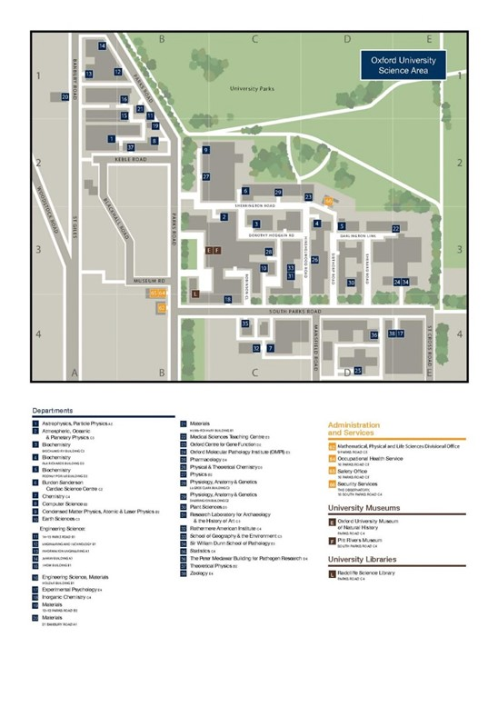

> hey! this is a demo for an alternate presentation of the course handbook, using Markdown and Docsify. it shouldn't (yet) be used as the ground truth for this content - please refer to the original PDFs before suing the dept xo
 _\- sam_

GENERAL COURSE HANDBOOK

**2021**

# Welcome

Welcome to Oxford! You have chosen to study at one of the world&#39;s leading centres for the development, application and teaching of Computer Science. You join a rapidly expanding group of researchers, lecturers and students, attracted to Oxford from all over the world. You are here because you deserve to be here and you want to study Computer Science. Our aim is to give you the best opportunity to study it that we can.

The Department of Computer Science has an international reputation for the strength of its research and teaching, built up over many years. Our current research ranges from exploring the fundamental issues of the meaning of programming languages, to the engineering of large-scale systems and the modelling of biological processes. Many of the people that teach you are involved in cutting-edge research, and this influences and informs the courses we teach, which are continually evolving.

The Department has been generously supported over the years by donations and sponsorship from many industrial partners. When you graduate, we are confident that you will have a sound basis for a productive and rewarding career.

This handbook is intended to help you find your feet in the Department, and to give you a handy reference to many of the things that will be unfamiliar about the way we run things here. In addition to this handbook, you will find specific information on your course in a supplement on the departmental website. If you think that the handbook could be improved in some way, or if you find that there is something misleading in it, do let us know.

During your study at Oxford we all hope to share with you some of the understanding we have gained from our own study, research and industrial collaboration. We hope too that you will be able to share with us – and with each other – your enthusiasm for the subject, and your own varied experiences. Above all, we hope that you will enjoy developing your talents in this exciting field.

# COVID-19

The global COVID-19 pandemic will still affect teaching, assessment and student life in the 2021-22 academic year. The nature of the impact is likely to change during this time, as government legislation and University policy adapt to changing circumstances.

You can find a summary of all relevant information [on the University&#39;s dedicated website](https://www.ox.ac.uk/coronavirus/students). Please keep everyone safe by abiding by the University&#39;s rules.

Please make sure that you are also familiar with the latest [national public health regulations](https://www.gov.uk/government/publications/coronavirus-outbreak-faqs-what-you-can-and-cant-do/coronavirus-outbreak-faqs-what-you-can-and-cant-do).

The Department of Computer Science is committed to maintaining the highest possible standards of education this year, with a focus on personalised teaching and supervision from leading academics. Your course syllabus will not change, though the mode of delivery might be different, with a mixture of online and face-to-face teaching. The situation is under constant review, and the balance between in-person and remote teaching may vary through the year. Please refer to the Department&#39;s [COVID-19 advice page](https://www.cs.ox.ac.uk/teaching/internal/covid19_student_advice.html) for information about how your lectures, classes and practicals will be organised each term. The Department will update you via email to any changes to this information.

During this year there may also be changes to opening times for buildings and libraries. We will always endeavour to keep you up to date with this information. Access to the building might also be limited and depending on the public health situation you might be asked to only come to the building when you have teaching sessions or meetings with academic or administrative staff.

If you need to speak to someone in the academic administration team please pop into room 114 or 115. At least one of us should be available most times. If the situation changes and we return to working from home then please send an email to academic.administrator@cs.ox.ac.uk and we will let you know when we are available so that you are spared a wasted trip. We are also more than happy to speak to you via Teams so please feel free to drop a message via this platform.

# Mission Statement

Christopher Strachey, the founder of the Programming Research Group at Oxford, wrote:

> It has long been my personal view that the separation of practical and theoretical work is artificial and injurious. Much of the practical work done in computing, both in software and in hardware design, is unsound and clumsy because the people who do it have not any clear understanding of the fundamental design principles of their work. Most of the abstract mathematical and theoretical work is sterile because it has no point of contact with real computing. One of the central aims of the Programming Research Group as a teaching and research group has been to set up an atmosphere in which this separation cannot happen.

The specific teaching mission of Department of Computer Science upholds this view.

It is:

1. to teach computing as a coherent science, with due emphasis on its mathematical foundations;
2. to teach information technology as an engineering discipline with its overriding goal of correct and cost-effective design based on rigorous scientific reasoning;
3. to offer a progressive range of options including hardware and software, theory and practice, general technology and illustrative applications;
4. to keep the syllabus in correspondence with the long-term needs of the employers of our graduates;
5. to develop the students&#39; intellectual abilities and personalities to fit them for future leadership of a demanding profession;
6. to conduct research contributing to these goals, and to publish textbooks to help ourselves and others to reach them.

# Disclaimer

This handbook applies to students starting an undergraduate or postgraduate degree in Computer Science, or one of the joint degrees with Computer Science, in Michaelmas term 2021. The information in this handbook may be different for students starting in other years.

The information in this handbook is accurate as at September 2021, however it may be necessary for changes to be made in certain circumstances, as explained at (insert link to relevant UG ([www.ox.ac.uk/coursechanges](http://www.ox.ac.uk/coursechanges))/PG
[www.graduate.ox.ac.uk/coursechanges](http://www.graduate.ox.ac.uk/coursechanges)) webpage). If such changes are made the department will publish a new version of this handbook together with a list of the changes and students will be informed.

| **Version** | **Action** | **Date** |
| --- | --- | --- |
| Version 1.0 | Published start of MT21 | |

***

# 1  Sources of information

This handbook is designed to help you find your way around the Department of Computer Science and the University of Oxford. It provides guidance to what facilities are available to you, how teaching and learning are organised, and how to find help if you&#39;ve got any problems. In addition to this handbook, you will find specific information regarding your course in a supplement which is [available on the](http://www.cs.ox.ac.uk/teaching/handbooks.html)[departmental website.](http://www.cs.ox.ac.uk/teaching/handbooks.html)

The handbook tries to save you time by telling you many of the things which you might discover by experience, or by asking; but it cannot tell you everything. This University is a complex institution, so do not be afraid to ask for information or advice. If you are an undergraduate student, your tutor is your first and best guide, so do ask him or her when you need help or advice. For graduate students, your supervisor is the person to go to. Below is a list of other places where you will find useful information regarding your degree.

## 1. 1 Examination regulations

The _Examination Regulations_ is the authoritative document on University examinations. The _Examination Regulations_ define the format for examinations, and changes to them are strictly regulated by the University to ensure that you cannot be disadvantaged by any changes which are made after you start your course. [_The Examination Regulations_ are available online](https://www.admin.ox.ac.uk/examregs/).

## 1.2 Department of Computer Science Website

This is one of the most important sources of information for your degree. The [website](http://www.cs.ox.ac.uk/ourstudents) has details of all course synopses and syllabuses which form part of this handbook, timetables, information about projects and past exam papers and examination. In the course of this academic year (2021/2022) all the teaching materials will be moved to a new virtual learning environment, Moodle. We will be in touch with you when this happens.

The [Department&#39;s intranet](https://intranet.cs.ox.ac.uk/) provides you with a host of practical information. If you need to contact the Department&#39;s IT Support, or have questions about Health and Safety, or need to find an internal telephone number, that&#39;s the place to go. There is a link to the intranet at the bottom of the departmental website.

## 1.3 University Student Handbook

Each year you will receive the latest version of the _University Student Handbook_. It forms part of your contract with the University. [It is available online](https://www.proctors.ox.ac.uk/handbook/handbook/)

## 1.4 Oxford Students website

[This website](https://www.ox.ac.uk/students?wssl=1) offers a host of information and is well worth exploring!

Your college will probably also have detailed guidance about its own regulations and requirements. Your tutor and your college office will be able to point you in the right direction.

# 2 Finding your way around

Your academic life in Oxford will involve two intimately connected but distinct institutions. You are a member both of a college and of the University; the teaching of your degree course involves both your tutor in college, and lectures, classes, and practicals in the Department of Computer Science, which is part of the University.

The University and its departments enable you to study for a degree, examine your competence at the end of that study, and award you a degree. Your College provides you with a home, feeds you, guides your study and organises some of your teaching. The students&#39; academic and personal well-being are principally the concerns of the colleges. Traditionally, most of the teaching was organised by and between the colleges; however, in science subjects in particular, the central provision of expensive equipment has led to an increased role for departments like the Department of Computer Science.

## 2.1 Academic Staff

The academic staff you will encounter are likely to be in three kinds of job. There are college tutors and college lecturers who are employed by your College to teach you and guide your study here; there are University Lecturers and other university staff who are employed to give lectures, to organise the degree courses and to examine; and there are departmental staff who are employed to run practical work and organise laboratory work and classes. However, most of the academic staff that you meet will be in at least two of these categories; thus you may well encounter the same person as a tutor in College, as a lecturer in the Department of Computer Science, and perhaps as an examiner when it comes to your University Examinations.

## 2.2 Support Staff

The Academic Administration team at the Department of Computer Science are responsible for supporting all aspects of teaching and examinations and work closely with the academic staff to do this. You will receive communications from them throughout the year, usually with regard to lectures, classes, practicals, examinations and projects. Please ensure that you read these emails and memos and respond where necessary. They are also available should you need assistance, and so if you think they can help you please contact them by email or pop into their office at the Department to see them in person.

Academic Admin Team:

- Leanne Carveth – Head of Student Administration, Disability co-ordinator and Harassment Officer
  - leanne.carveth@cs.ox.ac.uk Room 114
- Kathrin Gowers – Deputy Head of Student Administration
  - kathrin.gowers@cs.ox.ac.uk Room 114
- Jo Ponting – Academic Administrative Officer
  - jo.ponting@cs.ox.ac.uk Room 114

**Leanne, Kathrin, and Jo share an email address. To reach them please email academic.administrator@cs.ox.ac.uk.**

- Brenda Deeley – Staff Secretary
  - brenda.deeley@cs.ox.ac.uk Room 106
- Lucy Traves - MSc Administrator
  - lucy.traves@cs.ox.ac.uk Room 112
- Sarah Retz-Jones – Graduate Studies Administrator (on maternity leave until April 2022)
  - sarah.retz-jones @cs.ox.ac.uk Room 112
- Lyn Hambridge – Graduate Studies Assistant
  - lyn.hambridge@cs.ox.ac.uk Room 112

**Lucy, Sarah, and Lyn share an email address. To reach them please email graduate.studies@cs.ox.ac.uk.**

You can reach the communications and outreach team on news@cs.ox.ac.uk (for news items) and enquiries@cs.ox.ac.uk (for everything else). The Head of Communications and Outreach is Suzanna Marsh in Room 116.

## 2.3 The Department of Computer Science

The Department of Computer Science is spread over several buildings. The biggest one is the Wolfson Building, which houses lecture rooms, classrooms and computing labs. Some of your lectures and classes will take place in the Robert Hooke Building. The Departmental academic administrators organise lectures, practicals, classes, and projects.

The head of the Department of Computer Science in 2021/22 is [Prof. Leslie Goldberg](https://www.cs.ox.ac.uk/people/leslieann.goldberg/). For more information on who is doing what in the Department, you can consult the list of [Academic Duties](https://intranet.cs.ox.ac.uk/academic/academic_duties/)

### 2.3.1 [The Wolfson building](http://maps.ox.ac.uk/#places/oxpoints:40006001)

The main building of the Department of Computer Science is the Wolfson Building which stands at the south-eastern corner of what is known as the Keble Road Triangle consisting of Keble Road, Banbury Road and Parks Road. All rooms on the basement floor are numbered with a number beginning with 0-, rooms on the ground floor (Level 1) with a number beginning with 1-, rooms on the first floor (including the Library) with a number beginning with 2-, and so on.

The reception desk is at the main entrance, which is on Parks Road. The Wolfson Building opens at 08:30 and the doors are locked at 17:15 Monday to Friday. This might change depending on the public health situation. If it does, we will let you know.

Lecture Theatre A is on the basement floor and Lecture Theatre B is on the ground floor: they can be reached through the door to the right of the main Parks Road entrance, as can the seminar room 051 and the Student Social Area (room 048). There is a small kitchen in the basement which can be used to make hot drinks. Please do not to take food or drinks other than water into lecture rooms, seminar rooms, computer rooms, or laboratories.

### 2.3.2 [The Robert Hooke building](http://maps.ox.ac.uk/#/places/oxpoints:23232578)

The department has four seminar rooms in the Robert Hooke building, the Richard Bird Room, the Christopher Strachey room, the Tony Hoare Room and Room 114. These rooms will be used for classes and from time to time may be used for small lecture courses. The building is located on Parks Road, to the north of the University Museum. The building can be accessed using your University card.

### 2.3.3 Computing resources

The department&#39;s teaching network comprises two teaching labs with PCs running Linux. The largest teaching lab (T6.09) is located on level 6 of the [Thom Building](http://maps.ox.ac.uk/#/places/oxpoints:23232585) and contains 48 desktop PCs for students. The second lab (379) is located on level 3 of the [Wolfson building](http://maps.ox.ac.uk/#places/oxpoints:40006001) and contains 35 desktop PCs.

In addition to the desktop computers in the teaching labs, there are remote access facilities available to you. You can use these facilities to do practical work using your computer while you are not in one of the teaching labs. You have some [instructions](https://wiki.cs.ox.ac.uk/support/RemoteAccess)[on how to set up the remote access in your computer](https://wiki.cs.ox.ac.uk/support/RemoteAccess) available.

You will have some prior knowledge of using computers; however, you may not have specific experience with the type of systems available at Oxford. Therefore, we offer introductory sessions, designed to help you become more familiar with the systems and give you an opportunity to use the network and ask questions. Demonstrators are present at these sessions, giving you a chance to meet them and find out more about practicals.

Those courses which have practical work associated with them are supported by practical sessions in the Practicals Laboratory throughout the term. These sessions guarantee students exclusive access to the computing facilities they require to complete their work. Demonstrators are present at each session so that you can obtain help with the practicals as you are doing the work.

Although computers are often booked for practical sessions, there are times when these computers are available for students to use. This is mainly to facilitate work on projects. Many students also find it useful to be able to do further work on their practicals outside the regular practical times, or to take the opportunity to learn more about the facilities available.

### 2.3.4 Personal computers

You do not normally need your own computer; however while at least some of your teaching is delivered remotely you are strongly advised to bring one. In addition, you will be able to use the Department&#39;s computing facilities. The practical work associated with some courses is flexible enough to enable you to do the work on your own computer provided it is set up with appropriate software, or by using the [remote access facilities](https://wiki.cs.ox.ac.uk/support/RemoteAccess) available to you.

Your College IT officer will be able to advise you on remote access to the Department&#39;s facilities from your own computer, or the college&#39;s own computers.

If you decided to bring your own portable equipment to the Department, please note that you will not be allowed to plug into the wired ethernet network in the Practicals Laboratory in the Thom Lab or the Department. Wireless connection, via Eduroam, is available in these areas.

Any personal electronic devices brought to the Department are subject to [policies on](https://intranet.cs.ox.ac.uk/health-safety/electrical-equipment/)[electrical equipment](https://intranet.cs.ox.ac.uk/health-safety/electrical-equipment/) All staff, students, and visitors are co-responsible to ensure that they are electrically safe. In case of questions about electrical safety, please contact technicians@cs.ox.ac.uk.

### 2.3.5 Access to course material pages from outside ox.ac.uk

There is a lot of course material on the department web pages. This can be accessed from outside the Oxford communication networks.

If you try to access these pages from outside ox.ac.uk you will reach a page saying: &#39;Teaching material pages are only accessible to registered students and staff of Oxford University connecting from a host in the ox.ac.uk domain&#39;.

Please use your Single-Sign on username and password to access this material.

This material is made available for your use only (the copyright belongs to the authors). You should not pass it on to anyone else.

## 2.4 Other Departments

### 2.4.1 The Mathematical Institute

[The Mathematical Institute](https://www.maths.ox.ac.uk/) organises the degrees in Mathematics and joint disciplines. Lectures and tutorial classes for Mathematics courses are held in the Andrew Wiles Building, [in the Radcliffe Observatory Quarter](http://maps.ox.ac.uk/#/places/oxpoints:23232627) on Woodstock Road.

### 2.4.2 The Department of Engineering Science

[The Department of Engineering Science](http://www.eng.ox.ac.uk/) organises the University&#39;s Engineering degrees. The departmental building also houses our undergraduate Computing Laboratory in the [Thom Building](http://maps.ox.ac.uk/#/places/oxpoints:23232585) This building is the glass and concrete tower which dominates the Keble Road triangle and its entrance is from the elevated walkway. The Practicals Laboratory is on level 6 of the Thom Building, and there are lecture rooms on levels 1 and 8.

### 2.4.3 The Faculty of Philosophy

The [Faculty of Philosophy](https://www.philosophy.ox.ac.uk/home) is part of the Humanities Division and organises the University&#39;s degrees in Philosophy. [The Faculty of Philosophy is housed](http://maps.ox.ac.uk/#places/oxpoints:55095840) in the Radcliffe Observatory Quarter on Woodstock Road and this is where some

Philosophy lectures in Philosophy for the joint degree will take place.

### 2.4.4 Oxford University Language Centre

The [Language Centre](https://www.lang.ox.ac.uk/) provides courses and other resources to help you learn modern foreign languages, or to keep up and develop your skills. [It is situated on Woodstock](http://maps.ox.ac.uk/#/places/oxpoints:23233557)[Road](http://maps.ox.ac.uk/#/places/oxpoints:23233557) just north of St Giles church, and at the back of the IT Services building.

### 2.4.5 The Examination Schools

The Examination Schools is the department of the University that administers public examinations. It is [a building on the south side of High Street](http://maps.ox.ac.uk/#/places/oxpoints:23233550) east of University College. This building is likely to be the location of your final examinations. When not in use for examinations the rooms and halls of the Examination Schools are used for lectures in subjects which do not have their own lecture theatres, and for special lectures which draw large audiences. Some lecture courses in Philosophy are also held at the Examination Schools.

There is another examination hall in [Ewert House](http://maps.ox.ac.uk/#/places/oxpoints:23233623) in Summertown which may be used for your first year examination, known as &quot;Preliminary Examinations&quot;, or &quot;Prelims&quot;. You will be told where your examinations are to be held nearer the time. Timetables are published on the [University&#39;s Timetables site](https://www.ox.ac.uk/students/academic/exams/timetables?wssl=1)

## 2.5 Libraries

Your principal source for books and journals should be your College library. Your College librarian will tell you what it provides, and your College tutor will try to ensure that it provides the textbooks which are of most use for the course.

The main university library is the [Bodleian Library](https://www.bodleian.ox.ac.uk/) and its science department is the [Radcliffe Science Library](https://www.bodleian.ox.ac.uk/science) for all things mathematical.

The [Department of Computer Science Library](http://intranet.cs.ox.ac.uk/library/) contains books, monographic series, journals, technical reports and past theses covering the main research interests of the Department. It is principally for use by graduate students and staff, and is situated in room 240 on Level 2 of the building.

**Opening hours:** The library is open 24/7. Library staff are normally available from 09:00-13.00 and 14.00-16.30 Monday to Friday. [These hours may vary during 2021/22.]

**Registration:** you will be pre-registered but you must confirm your registration by bringing your University Card to the library before you begin to borrow.

**The Catalogue:** books and journals are listed on [SOLO](http://solo.bodleian.ox.ac.uk/primo-explore/search?vid=SOLO&amp;lang=en_US&amp;sortby=rank)(the University-wide online catalogue).

**Borrowing:** members are limited to 12 books at any one time. Books may be borrowed for 3 weeks at a time with possibility of renewal for a further three periods of three weeks unless a book has been recalled by another reader. Books are borrowed using the automated self-issue system. Please ask if you have problems using the machine.

**Short-loan Collection:** books in the short loan collection may be borrowed for 6 days with possibility of renewal for a further six periods of 6 days. They are kept in locked bookcases and can only be borrowed when the library is manned or by email request.

**Other services:** The library has a compact study area with a dedicated terminal for SOLO catalogue searches and a computer for general internet searches.The library also contains copies of the MSc and D.Phil. theses submitted by students attached to the Department.

**Contact the Library:** Michael Neville (Librarian), Aza Ballard-Whyte (Library Assistant), telephone 73837, email library@cs.ox.ac.uk.

**Finding resources:** see [www.bodleian.ox.ac.uk/finding-resources](http://www.bodleian.ox.ac.uk/finding-resources)

# 3 Studying, learning and teaching

Please see the [University&#39;s Study Skills and Training](https://www.ox.ac.uk/students/academic/guidance/skills?wssl=1) site for useful advice on a variety of study skills, from Managing your Workload, over Research and Library Skills, to Revision and Examinations.

## 3.1 Lectures

Lectures are the main forum where course material is presented. Each term&#39;s Computer Science lecture timetable with details of lecture rooms is posted online at [www.cs.ox.ac.uk/teaching/timetables/](http://www.cs.ox.ac.uk/teaching/timetables/)

Those for mathematics appear on the screen in the Mathematical Institute, and can also be found online at [https://www.maths.ox.ac.uk/members/students/lecture](https://www.maths.ox.ac.uk/members/students/lecture-lists)[lists](https://www.maths.ox.ac.uk/members/students/lecture-lists)

Philosophy lectures are usually given in Examination Schools. You can find the timetable here: [https://www.philosophy.ox.ac.uk/lectures](https://www.philosophy.ox.ac.uk/lectures)

### Michaelmas term 2021

In this term large lectures will be delivered remotely, either pre-recorded or live, which will be recorded and made available to be viewed by students who are not able to attend the live session. Lectures attended by fewer than 50 students may be delivered in person.

Details of where to find lectures and the method of delivery will be posted on the [course materials page for each course](http://www.cs.ox.ac.uk/teaching/courses/)

You will be notified of any changes via email.

## 3.2 Tutorials in Computer Science and Mathematics

Tutorials are your main opportunity for developing a deep understanding of a subject – and for sorting out misunderstandings. On average you can expect to have two or three tutorials or classes per week. Each tutor has particular methods and particular ways of organising tutorials, and will adapt your tutorials to give you the best opportunities for learning. Many tutors will base their tutorials around problem sheets issued by lecturers to accompany their lectures. Your tutor should be the first person you ask for advice on how to study, and later on how to choose optional subjects.

#### 3.2.1 Problem sheets

Lecturers will usually suggest exercises that relate to the material in their lectures. Your attempts at these will often be taken as a framework for the tutorials or classes that accompany the course. In some cases you will find the sheets of suggested problems give you only a start on work in the subject; in others you will find that the sheet consists of a range of exercises intended to suit groups with different backgrounds and that your tutor suggests that you tackle only some of them.

Problem sheets for courses in Computer Science subjects are normally available from [www.cs.ox.ac.uk/teaching/courses/](http://www.cs.ox.ac.uk/teaching/courses/)

## 3.3 Tutorials in Philosophy (for Computer Science &amp; Philosophy students)

For tutorials in Philosophy you will be expected to bring knowledge of the readings which have been set for it (or a variant on your own initiative if some items prove really inaccessible) and almost always an essay in which you address some aspect of the topic covered by the readings.

Work on a tutorial essay in Philosophy involves library searches, reading, thinking, and writing. It should occupy a minimum of three days. Read attentively and thoughtfully, skipping bits that obviously do not bear on your topic: one hour of that is worth many hours of `summarising&#39; paragraph by paragraph. As your reading progresses, think of a structure for your essay (but do not write an elaborate plan which you won&#39;t have time to execute). Expect to have to worry out your thoughts, both during and after reading. Use essays to develop an argument, not as places to store information. You can assume that your tutor knows what is in the set reading, and is not interested in a simple re-hash of that. But they will be interested in your critical appraisal of what you have read, and any arguments of your own that bear upon the topic. At the same time, it is important that the relation of what you say in your essay to what you have read can be made explicit if discussion in tutorial turns on it, and for this reason, it is important to include page references to your readings for points you criticise or make use of.

You will learn a lot if you share and discuss ideas with your fellow students, and if you chance your arm in tutorials. Be enterprising, and be prepared to be wrong, for that is how one learns. (Remember that Oxford&#39;s system is not one of continuous assessment; it is what you can do at the end that matters, and not the various mistakes that you will inevitably make on the way.) And bear in mind that tutorials are not designed as a substitute for lectures, or for accumulating information, but to develop the capacity to think on the spot and to articulate your thinking clearly in responding to issues raised about ideas in the essay you or a tutorial partner are presenting. This means that note-taking, if it occurs in a tutorial at all, should be incidental to the dialogue. Producing essays for philosophy tutorials gives excellent training in writing, and particularly in writing to a deadline. You will need to equip yourself with a writer&#39;s tools, most crucially a dictionary, such as the Concise Oxford Dictionary or the online [Oxford English Dictionary](https://www.oed.com/)

## 3.4 Practicals

Please find more information in the [Courses section of the website of the](http://www.cs.ox.ac.uk/teaching/courses/2019-2020/practicals/)[Department of Computer Science](http://www.cs.ox.ac.uk/teaching/courses/2019-2020/practicals/)

## 3.5 Projects

[Please find more information here](http://www.cs.ox.ac.uk/teaching/courses/projects/)

## 3.6 Expectation of study and student workload

This document concentrates on the _teaching_ arrangements for the course, but of course the important thing is _learning_. We will provide facilities and resources to assist your learning, and do what we can to help and encourage you to learn; but you are responsible for your own academic progress.

As well as attending and preparing for lectures and tutorials, you will need to read other material and to work through additional problems to fully master the course material. The lists of books which accompany course synopses are a good place to start on further reading, and (as always) your tutor will be able to suggest further avenues of study.

It is particularly important to do exercises, both paper-and-pencil calculation and design exercises, and practical work with a computer. There is nothing which fixes and deepens understanding of material in a field like this quite like &#39;doing it yourself&#39;.

You may want to have a look at [Charles Batty&#39;s notes](http://solo.bodleian.ox.ac.uk/primo-explore/fulldisplay?docid=oxfaleph010985848&amp;context=L&amp;vid=SOLO&amp;lang=en_US&amp;search_scope=LSCOP_ALL&amp;adaptor=Local%20Search%20Engine&amp;isFrbr=true&amp;tab=local&amp;query=any,contains,batty%20how%20do%20undergraduates%20do%20mathematics&amp;sortby=rank&amp;facet=frbrgroupid,include,350249476&amp;offset=0)[_How do Undergraduates do_](http://solo.bodleian.ox.ac.uk/primo-explore/fulldisplay?docid=oxfaleph010985848&amp;context=L&amp;vid=SOLO&amp;lang=en_US&amp;search_scope=LSCOP_ALL&amp;adaptor=Local%20Search%20Engine&amp;isFrbr=true&amp;tab=local&amp;query=any,contains,batty%20how%20do%20undergraduates%20do%20mathematics&amp;sortby=rank&amp;facet=frbrgroupid,include,350249476&amp;offset=0)[_Mathematics?_](http://solo.bodleian.ox.ac.uk/primo-explore/fulldisplay?docid=oxfaleph010985848&amp;context=L&amp;vid=SOLO&amp;lang=en_US&amp;search_scope=LSCOP_ALL&amp;adaptor=Local%20Search%20Engine&amp;isFrbr=true&amp;tab=local&amp;query=any,contains,batty%20how%20do%20undergraduates%20do%20mathematics&amp;sortby=rank&amp;facet=frbrgroupid,include,350249476&amp;offset=0) which, as well as being relevant to any Mathematics courses you take, might help you with your Computer Science courses. It can be found on the web at [https://www.maths.ox.ac.uk/system/files/attachments/study\_public\_0.pdf](https://www.maths.ox.ac.uk/system/files/attachments/study_public_0.pdf)

If you feel you have just Too Much To Do, please get in touch with your College tutor or the academic administration team in the Department. We will be able to help you.

On this note, please read the [University&#39;s guidance on paid work](https://www.ox.ac.uk/students/life/experience?wssl=1)

If you have any issues with teaching or supervision please raise these as soon as possible so that they can be addressed promptly. Details of who to contact are provided in the Complaints and Appeals section below.

# 4 Examinations

Please see also the University&#39;s [Examinations and Assessments website](https://www.ox.ac.uk/students/academic/exams?wssl=1)

## 4.1 Preparation

Your tutor will advise you about revision and practice. As well as any consolidation work done after the end of a term, it is usual to spend at least a good part of Trinity term revising work for that year&#39;s examinations.

In subjects that have been taught in previous years, past examination papers are good guides to the sort of examination question that you might be set. In newer subjects you will usually be offered model questions, or some other guidance on the sort of thing to expect. Past papers can be found on the Web at [www.cs.ox.ac.uk/teaching/examinations/](http://www.cs.ox.ac.uk/teaching/examinations/) and [OXAM](https://weblearn.ox.ac.uk/portal/site/:oxam)

Also available are the [_Examiners&#39; Reports_](http://www.cs.ox.ac.uk/teaching/examinations/) for the past few years, which contain – amongst other things – the examiners&#39; reflections on which questions turned out to be very difficult or had other problems.

## 4.2 Entering for Examinations

Entering for examinations is completed online – please see the [University&#39;s guidance](https://www.ox.ac.uk/students/academic/exams/entry?wssl=1)[here](https://www.ox.ac.uk/students/academic/exams/entry?wssl=1) Together with your timetable you will receive a randomly allocated _candidate number_ which you will use to identify your scripts, instead of your name and College, so that they can be marked anonymously.

Information on the standards of conduct expected in examinations, what to do if you would like examiners to be aware of any factors that may have affected your performance before or during an examination (such as illness, accident or bereavement), alternative arrangements and more are available on the [Oxford](https://www.ox.ac.uk/students/academic/exams/guidance)[Students website on Examinations and Assessments](https://www.ox.ac.uk/students/academic/exams/guidance)

## 4.3 Notices to Candidates

Before your examination you will receive one or more _notice to candidates_ from the examiners which will tell you of any details of the examination procedure that are different from the usual. Notices to candidates will be sent to you by the academic administration team. These notices contain important information about your examinations and should be read very carefully. If you have any questions then please ask your tutor; you must not contact the examiners directly.

## 4.4 Examination Conventions

Examination conventions are the formal statement of the specific assessment standards for the course or courses to which they apply. They set out how your examined work will be marked and how the resulting marks will be used to arrive at a final result and classification of your award. They include information on: marking scales; marking and classification criteria; scaling of marks; progression; resits; use of viva voce examinations; penalties for late submission; and penalties for over-length work.

The Examination Conventions for all undergraduate degree programmes can be found at [https://www.cs.ox.ac.uk/teaching/examinations/](https://www.cs.ox.ac.uk/teaching/examinations/)

There are three sets of University examinations which you have to pass on your route to a BA degree: Preliminary Examinations (&#39;Prelims&#39;) at the end of your first year, and the two parts (Parts A and B) of the Final Honour School (&#39;Finals&#39;) at the end of your second and third years. These are called the _public examinations_, as opposed to any _collections_ which are tests that your College may set you from time to time to help keep you on your toes and to assess your progress. If you carry on to do a Masters degree, you will take additional public examinations in the fourth year (Part C).

For all examinations, the examiners base their assessment of your performance in the examination on a mark out of 100 for each paper; they might decide to scale a paper if it seemed students found it more difficult than others. The examiners have the discretion of taking [Mitigating Circumstances](https://www.ox.ac.uk/students/academic/exams/guidance) applications or other evidence into account when arriving at standardised marks for each paper. The marks for each paper are combined to obtain an overall mark out of 100.

## 4.5 Procedure for in –person written Examinations

[In the academic year 2020-21 the Department of Computer Science is planning to conduct Preliminary and Part A examinations in-person. If COVID-19 restrictions change during the course of the year they may be moved online.]

Your Preliminary Examinations are likely to be held at [Ewert House](http://maps.ox.ac.uk/#/places/oxpoints:23233623) in Summertown. You can expect your second year examinations to be held in the [Examinations](http://maps.ox.ac.uk/#/places/oxpoints:23233550)[Schools](http://maps.ox.ac.uk/#/places/oxpoints:23233550) on the High Street. Please look at the screens in the foyer to find out in which room your exam is going to be sat.

You must wear [full academic dress](https://www.ox.ac.uk/students/academic/dress?wssl=1)(sub fusc, gown and mortar board/cap) to attend public examinations, and you must bring your University card and your own stationery with you. Please find more information on what you can and cannot take into an examination [here](https://www.ox.ac.uk/students/academic/exams/guidance?wssl=1)

You should make every effort to be on time for examinations. If you are not there at the start of the examination, attempts will be made to contact your College to find out why not. If you get there in the first half hour, you will still be permitted to sit the exam, although you will have less time. Nobody may leave an examination until half an hour after it starts.

Desks are identified by your name and college, with the desks in alphabetical order of names, but you will need to know your candidate number so that you can write this (and _ **not** _your name or student number) on your script when you hand it in. For each paper that you sit you will be given a cover sheet on which you identify yourself by your candidate number, and the paper by its number and title.

The question paper will be on your desk when you go in to the examination. You should check that it is the paper that you have entered for, and you should carefully read the instructions on the cover, but you may not open it until told to do so. Read the wording of each question carefully, and make sure that you have not missed out any parts.

You will be provided with booklets of ruled A4 paper in which to write your answers. The [University&#39;s regulations](https://www.ox.ac.uk/students/academic/exams/guidance?wssl=1) require that you write in black or blue ink, rather than pencil, although you may use pencil for any graphs and drawings. Please start the answer to each question on a new booklet. This makes it much easier for the marker(s) – sometimes exam scripts need to be split between markers, and that&#39;s difficult to do if you have the answer to more than one question in a booklet. If you do start part way through a booklet by accident, please make a clear note of the fact!

You must write legibly: if nothing else it will avoid annoying the marker; but there is a provision for illegible scripts [to be typed](https://www.admin.ox.ac.uk/examregs/2017-18/rftcoue-p16markandasse/)[_at the expense of the candidate_](https://www.admin.ox.ac.uk/examregs/2017-18/rftcoue-p16markandasse/)

You will be given instructions at the examination about handing in your script. It is your responsibility to do this: anything left on your desk is liable to be thrown away by the person clearing the room. There will be treasury tags available for you to use to attach booklets together. The rubric on the paper will tell you whether to bind everything in one bundle, or whether to hand in answers to different parts of the paper with separate cover sheets. If you do not attempt any questions from one part of the paper, you should still hand in an empty booklet for that part, so that the examiners can check that all parts of all papers are accounted for.

## 4.6 Procedure for open-book examinations

In 2020/21 the Department of Computer Science is planning for written examinations for Part B and Part C to be conducted via open-book online examinations. The University has published [guidance](https://www.ox.ac.uk/students/academic/exams/open-book) for these examinations.

The Department will also communicate arrangements for these examinations in Notices to Candidates ahead of Trinity term 2021.

# 5 Feedback on Learning and Assessment

During your time at Oxford there will be plenty of opportunities for you to get informal feedback: tutorial sessions provide your tutors with an opportunity to give you informal feedback on your academic progress, and the same goes for classes, practicals and even working groups with your peers.

## 5.1 Formative Assessment

There are various opportunities for you to receive feedback on formative assessment: your tutor will give you feedback on tutorial essays and college collections, and the practicals demonstrators will mark your practical reports.

## 5.2 Summative Assessment

Apart from your marks, you will not normally get individual feedback on public examinations. However, the [Freedom of Information Act 2000](https://www.admin.ox.ac.uk/councilsec/compliance/foi/) provides a right of access to information held about you, which includes examination material. If you failed an examination paper you and your college tutor will be able to see your script, so that he or she can explain to you what went wrong.

Examiner&#39;s reports serve as a source for feedback on the performance of your cohort, as they include statistics on paper marks and overall outcomes, and contain the assessor&#39;s reports on each paper.

**You also have the opportunity to provide feedback to us:**

Your views on how well your course works are an important part of the mechanism for determining how we can improve it for the future, so there are many opportunities for you to comment on the course.

Informally, you can make your views known directly to the academic staff who teach you in lectures, classes, and tutorials. In particular, you might like to make comments to your College Tutor, the Chair of the Faculty or the Director of Teaching. All academic staff will encourage you to make your views known to them and will give you ample opportunity to comment on syllabus content and any other issues about the delivery of the course.

## 5.3 Course questionnaires

Formally, feedback for courses is given via online and/or paper course questionnaires. You will be invited by email to complete an online survey on all aspects (lectures, classes and practicals) of the courses you have attended each term or the course lecturer will ask you to complete a paper questionnaire towards the end of the course. Even if you have decided not to continue on the course, you are welcome to give feedback and let us know why. Student feedback is greatly valued by the Department and plays a large part in the quality assurance process.

The Senior Management Team and the Education Committee in the Department of Computer Science review all courses after they have run, looking in particular at feedback from questionnaires, to consider ways of improving the teaching. Proposed changes to the syllabus and synopsis of courses are considered by the supervisory committees responsible for the courses (see section 6.1), and an analysis of the statistics on each course is sent to the lecturer of that course.

## 5.4 University-wide Feedback

Students on full-time and part-time matriculated courses are surveyed once per year on all aspects of their course (learning, living, pastoral support, college) through the Student Barometer. Previous results can be viewed by students, staff and the general public [online](https://www.ox.ac.uk/students/life/student-engagement)

Final year undergraduate students are surveyed instead through the National Student Survey. Results from previous NSS can be found at on the [NSS website](https://www.officeforstudents.org.uk/advice-and-guidance/student-information-and-data/national-student-survey-nss/get-the-nss-data/)

# 6 The University and you

## 6.1 The Department of Computer Science

The central administration of the University is devolved to a number of _divisions_, amongst them the [Division of Mathematical, Physical and Life Sciences (MPLS)](https://www.mpls.ox.ac.uk/) which is in practice the authority that controls your degree course.

Within the MPLS Division, the [Department of Computer Science](http://www.cs.ox.ac.uk/) controls the development of the subject in the University. The members of the Department meet at least once a term to discuss matters including changes to the composition of the degree, and to consider reports on the previous year&#39;s teaching and examinations. You can find a [list of the departmental committees](https://intranet.cs.ox.ac.uk/central/committees/) on the intranet.

**6.1.1** [**Joint Consultative Committee for Undergraduates (JCCU)**](http://www.cs.ox.ac.uk/currentstudents/JCCU/)

We have a formal structure for undergraduate consultation and representation in Computer Science. The JCCU is a committee which comprised of representatives from the student body with a representative from each year of each degree within Computer Science, in addition the committee is co-chaired by an academic member of staff. There is an open meeting in week 3 in which the Chair of this committee will invite students to nominate or volunteer for a position on the committee. The committee meets in week 4 of each term to discuss any issues raised by student representatives.

In addition one or two members of the committee will be invited to attend the Faculty meeting in week 6 of each term to raise any issues there, as appropriate.

**6.1.2** [**Joint Consultative Committee for Graduates (JCCG)**](http://www.cs.ox.ac.uk/teaching/dphil/JCCG.html)

JCCG is the equivalent to JCCU for graduate students: this committee provides formal representation of graduate student in the department. The committee consists of the Director of Graduate Studies, the Academic Administrator, the Graduate Studies Administrator and representatives from DPhil, MSc and CDT students. Two MSc and two DPhil students will be elected by the students from each year&#39;s cohort and will remain on the Committee for the duration of their studies. One CDT representative from AIMS and one from Cyber Security will be elected each year and remain on the committee. The Committee is concerned with matters such as training, supervision, research facilities for research degree students and social events.

**6.1.3** [**The Mathematics Undergraduates Representative Committee**](https://www.maths.ox.ac.uk/members/students/undergraduate-courses/undergraduate-representation/murc)

The Mathematics Undergraduates Representative Committee (MURC) is organised by undergraduates on the various Mathematics and Computer Science degrees. It has representatives at each of the colleges, and acts amongst other things as a formal channel for bringing feedback directly to the central administration of these subjects.

**6.1.4** [**Division and University representation**](https://www.mpls.ox.ac.uk/study/applicants/student-representation)

Student representatives sitting on the Divisional Board are selected through a process organised by the Oxford University Student Union (OUSU). Details can be found on the [OUSU website](https://www.oxfordsu.org/) along with information about student representation at the University level.

## 6.2 The Proctors

With luck (and good judgement on your part) you will not have much to do with the [Proctors](https://www.proctors.ox.ac.uk/) are senior members of colleges, elected for a year at a time by their colleges in turn to keep the University in line. They have many administrative duties, but some in particular may bring them into contact with undergraduates.

The Proctors are responsible for ensuring that all examinations are conducted properly, for implementing student discipline at University level, for registering student clubs and societies, and for investigating complaints. In this latter capacity they may summon any member of the University to appear before them. The Assessor has special responsibilities for student welfare. Based in a separate section of the University Offices in Wellington Square, the Proctors and Assessor are supported by the Clerk to the Proctors and a small secretarial staff.

## 6.3 Student Life

On the University&#39;s webpages for students, you will find a host of information about practicalities to do with all aspects of [student life](https://www.ox.ac.uk/students?wssl=1) and much, much more.

For graduate students: [The Computer Science Graduate Society (CoGS)](https://www.cs.ox.ac.uk/societies/COGS/) is your platform for the academic and social life in the department. Please find more information on [Computer Science-specific societies on our website](https://www.cs.ox.ac.uk/societies/COGS/)

You are very welcome to attend the Fridays@2 series at the Mathematical Institute. Fridays@2 are a series of seminars that start in Week 1 of Michaelmas Term. This weekly programme is designed specifically for undergraduate and masters students. The sessions are designed to help students to develop useful skills, to explore career possibilities, and to put their mathematics courses into a broader context.

The Fridays@2 timetable can be found at [https://www.maths.ox.ac.uk/events/list](https://www.maths.ox.ac.uk/events/list)

The department is running a series of seminars and public lectures. They are all listed [on the departmental website](http://www.cs.ox.ac.uk/seminars/)

[Seminars and public lectures may take place online in 2020/21: please refer to the websites for the latest information.]

Looking after yourself is very important. It might be a good idea to join a [club or](https://www.ox.ac.uk/students/life/clubs/list?wssl=1)[society](https://www.ox.ac.uk/students/life/clubs/list?wssl=1)

[The University has produced lots of [guidance and support for student life and well](https://www.ox.ac.uk/coronavirus/students/student-life)[being](https://www.ox.ac.uk/coronavirus/students/student-life) during the COVID-19 pandemic, which is updated regularly in line with government legislation. There is also support and guidance on what to do if you need to [self-isolate](https://www.ox.ac.uk/sites/files/oxford/Guidance%20for%20self%20isolating.pdf)]

The University has a wide range of policies and regulations that apply to students. These are easily accessible through the [A-Z of University regulations, codes of](https://www.ox.ac.uk/students/academic/regulations?wssl=1)[conduct and policies](https://www.ox.ac.uk/students/academic/regulations?wssl=1) available on the Oxford Students website. The University&#39;s [equality and diversity policies and more can be found here](https://edu.admin.ox.ac.uk/home) Please see also section6.5 in this handbook.

## 6.4 Outreach

The department offers a wide-ranging outreach programme, generally aimed at UK school students. All our students are very welcome to join the department&#39;s student ambassador scheme.

Training sessions are held in Michaelmas Term. You will then receive an official ambassador t-shirt, and be added to a mailing list. You will be contacted as opportunities, including paid work, are announced. As a trained ambassador you should undertake a minimum of one event per year, but there is no upper limit.

If you are interested in giving talks, running practical coding sessions for kids, helping out at open days, or just want to find out more may also contact the Schools Liaisonteam to discuss opportunities.

## 6.5 When Things Go Wrong

Life can be a bit overwhelming at times for everyone, and it is crucial to seek support before it becomes All Too Much. If you are feeling unwell or unhappy, your College should be your first port of call. Each College has their own systems of support for students. Please refer to your College handbook or website for more information on who to contact and what support is available through your College. In addition, and especially for course-related matters, the academic admin team is always happy to help or just talk!

##### 6.5.1 Health and Welfare

The University [Oxford Students website contains](https://www.ox.ac.uk/students/welfare/health?wssl=1) comprehensive advice on a variety of issues around student health and welfare. You have free access to the [National](https://www.nhs.uk/NHSEngland/thenhs/about/Pages/overview.aspx)[Health Service](https://www.nhs.uk/NHSEngland/thenhs/about/Pages/overview.aspx)

[If you think you may have [symptoms of COVID-19](https://www.nhs.uk/conditions/coronavirus-covid-19/symptoms/) you can [obtain a test via the](https://www.ox.ac.uk/coronavirus/health/covid-testing)[University](https://www.ox.ac.uk/coronavirus/health/covid-testing)(among other advantages, this is likely to be quicker than the NHS service). If you have symptoms you will need to [self-isolate](https://www.nhs.uk/conditions/coronavirus-covid-19/self-isolation-and-treatment/how-long-to-self-isolate/)– the University has produced [guidance on how to do this in your college](https://www.ox.ac.uk/sites/files/oxford/Guidance%20for%20self%20isolating.pdf) will help your distinguish between the symptoms of COVID-19, colds and flu.]

If you experience sexual violence you can get [help and advice here](https://www.ox.ac.uk/students/welfare/sexual-violence?wssl=1)

Please click [here for a list of emergency contacts](https://www.ox.ac.uk/students/help?wssl=1)

If you have a disability, or think you might, please [find advice on how to get support](https://www.ox.ac.uk/students/welfare/disability?wssl=1)[here](https://www.ox.ac.uk/students/welfare/disability?wssl=1)

Your mental health is just as important as your physical health. Approximately [1 in 4](https://digital.nhs.uk/data-and-information/publications/statistical/adult-psychiatric-morbidity-survey/adult-psychiatric-morbidity-in-england-2007-results-of-a-household-survey)[people](https://digital.nhs.uk/data-and-information/publications/statistical/adult-psychiatric-morbidity-survey/adult-psychiatric-morbidity-in-england-2007-results-of-a-household-survey) in the UK will experience a mental health problem each year, and there is no shame in admitting you are one of them. There is a variety of things you can do yourself to [boost your mental health](https://www.nhs.uk/conditions/stress-anxiety-depression/) for students. It is important that you **seek help as early as possible** , just like you would do if you had an infection, or broken a leg.

If you think you or someone you know might have a problem with their mental health, please speak to your College tutor.

##### 6.5.2 Harassment

By University legislation, it is an offence for any senior or junior member of the University to harass any other member or any person for whom the University is responsible. Sexual and racial harassment are among the forms of harassment covered by this rule, but it also covers any form of intentional or unintentional teasing, embarrassment or bullying which causes inconvenience or unhappiness, particularly if persistent.

The University&#39;s Oxford Students website provides help and advice for students [here](https://www.ox.ac.uk/students/welfare/harassment?wssl=1)

The Harassment Advisors for the Department of Computer Science are: Mrs L. Carveth (Room 114) Tel. 73833 leanne.carveth@cs.ox.ac.uk Professor L. Ong (Room 340) Tel. 83522 luke.ong@cs.ox.ac.uk

##### 6.5.3 Complaints and Appeals

The University, the MPLS Division and the Department of Computer Science all hope that provision made for students at all stages of their course of study will make the need for complaints (about that provision) or appeals (against the outcomes of any form of assessment) infrequent.

If you do think you have grounds for a complaint or an academic appeal, you can find details about the [University&#39;s complaint procedure here](https://www.ox.ac.uk/students/academic/complaints?wssl=1)

However, nothing in the University&#39;s complaints procedure precludes an informal discussion with the person immediately responsible for the issue that you wish to complain about (and who may not be one of the individuals identified below). This is often the simplest way to achieve a satisfactory resolution.

Many sources of advice are available within colleges, within faculties/departments and from bodies like [Student Advice Service](https://www.oxfordsu.org/wellbeing/student-advice/) provided by OUSU or the [Counselling](https://www.ox.ac.uk/students/welfare/counselling?wssl=1)[Service](https://www.ox.ac.uk/students/welfare/counselling?wssl=1) which have extensive experience in advising students. You may wish to take advice from one of these sources before pursuing your complaint.

General areas of concern about provision affecting students as a whole should be raised through Joint Consultative Committees or via student representation on the Department&#39;s committees.

### Complaints

If your concern or complaint relates to teaching or other provision made by the Department, then you should raise it with the Director of Teaching (Dr Ani Calinescu in Michaelmas and Hilary terms, Professor Standa Zivny in Trinity term)or with the Director of Graduate Studies (Dr Luke Ong in Michaelmas and Trinity Terms, and Professor Jonathan Barrett in Hilary Term) as appropriate. Within the department the officer concerned will attempt to resolve your concern/complaint informally.

If you are dissatisfied with the outcome, then you may take your concern further by making a formal complaint to the University Proctors. The procedures adopted by the Proctors for the consideration of complaints and appeals are described on the [Proctors&#39; webpage](https://www.proctors.ox.ac.uk/resources-for-students)

If your concern or complaint relates to teaching or other provision made by your College, you should raise it either with your tutor or with the Senior Tutor. Your College will also be able to explain how to take your complaint further if you are dissatisfied with the outcome of its consideration.

### Academic appeals

An academic appeal is defined as a formal questioning of a decision on an academic matter made by the responsible academic body.

For undergraduate or taught graduate courses, a concern which might lead to an appeal should be raised with your College authorities and the individual responsible for overseeing your work. It must not be raised directly with examiners or assessors. If it is not possible to clear up your concern in this way, you may put your concern in writing and submit it to the Proctors via the Senior Tutor of your college.

As noted above, the procedures adopted by the Proctors for the consideration of complaints and appeals are described [here](https://www.ox.ac.uk/students/academic/complaints)

Please remember in connection with all the academic appeals that:

- The Proctors are not empowered to challenge the academic judgement of examiners or academic bodies.
- The Proctors can consider whether the procedures for reaching an academic decision were properly followed; i.e. whether there was a significant procedural administrative error; whether there is evidence of bias or inadequate assessment; whether the examiners failed to take into account special factors affecting a candidate&#39;s performance.
- On no account should you contact your examiners including external examiners or assessors directly.

## 6.6 Careers

Information about careers is provided by [Oxford University Careers Service](http://www.careers.ox.ac.uk/) 56 Banbury Road. The Careers Service organise many events to help you choose a career that suits you, and to put you in touch with recruiters.

You are urged to contact the Careers Service for detailed information on careers, and also for advice on compiling a CV, on how to apply, and on interview technique.

When we receive information about careers suitable for Computer Science graduates, it is put on the Careers notice board in the basement of the Department of Computer Science or circulated by email. Information on job vacancies (together with summer internships and competitions) can also be found on our web site at [https://www.cs.ox.ac.uk/recruiters/internal/vacancies.html](https://www.cs.ox.ac.uk/recruiters/internal/vacancies.html).

# Annexe [A] Plagiarism

The University&#39;s code of conduct concerning academic integrity is set out on the website [here](https://www.ox.ac.uk/students/academic/guidance/skills/plagiarism?wssl=1)

The following information and advice is of relevance and use to students for all their academic work, e.g. mini projects, third and fourth year projects, as well as all class and practical work.

Since plagiarism is treated as a serious breach of academic integrity, it is important that you ensure you that you understand fully what is meant by the term &quot;plagiarism&quot;, how to avoid it in your writing, and the potential consequences of either deliberate or inadvertent plagiarism.

We recommend that you complete this online plagiarism course before embarking on your project:

[https://weblearn.ox.ac.uk/portal/hierarchy/skills/generic/avoidplag](https://weblearn.ox.ac.uk/portal/hierarchy/skills/generic/avoidplag)

At the end of the course there is a quiz to test your knowledge; if successful you can print out a certificate for your records. The course also provides an accessible source of information and advice about plagiarism. You should use it in conjunction with the advice on these pages.

**What is plagiarism?**

Plagiarism is the copying or paraphrasing of other people&#39;s work or ideas into your own work without full acknowledgement. All published and unpublished material, whether in manuscript, printed or electronic form, is covered under this definition.

Collusion is another form of plagiarism involving the unauthorised collaboration of students (or others) in a piece of work.

Cases of suspected plagiarism in assessed work are investigated under the disciplinary regulations concerning conduct in examinations. Intentional or reckless plagiarism may incur severe penalties, including failure of your degree or expulsion from the university.

**What forms can plagiarism take?**

- Verbatim quotation of other people&#39;s intellectual work without clear acknowledgement. Quotations must always be identified as such by the use of either quotation marks or indentation, with adequate citation. It must always be apparent to the reader which parts are your own independent work and where you have drawn on someone else&#39;s ideas and language.
- Paraphrasing the work of others by altering a few words and changing their order, or by closely following the structure of their argument, is plagiarism because you are deriving your words and ideas from their work without giving due acknowledgement. Even if you include a reference to the original author in your own text you are still creating a misleading impression that the paraphrased wording is entirely your own. It is better to write a brief summary of the author&#39;s overall argument in your own words than to paraphrase particular sections of his or her writing. This will ensure you have a genuine grasp of the argument and will avoid the difficulty of paraphrasing without plagiarising. You must also properly attribute all material you derive from lectures.
- Cutting and pasting from the Internet. Information derived from the Internet must be adequately referenced and included in the bibliography. It is important to evaluate carefully all material found on the Internet, as it is less likely to have been through the same process of scholarly peer review as published sources.
- Collusion. This can involve unauthorised collaboration between students, failure to attribute assistance received, or failure to follow precisely regulations on group work projects. It is your responsibility to ensure that you are entirely clear about the extent of collaboration permitted, and which parts of the work must be your own.
- Inaccurate citation. It is important to cite correctly, according to the conventions of your discipline. Additionally, you should not include anything in a footnote or bibliography that you have not actually consulted. If you cannot gain access to a primary source you must make it clear in your citation that your knowledge of the work has been derived from a secondary text (e.g. Bradshaw, D. Title of Book, discussed in Wilson, E., Title of Book (London, 2004), p. 189). For more guidance on how to reference correctly, see [http://www.cs.ox.ac.uk/files/3161/Referencing.pdf](http://www.cs.ox.ac.uk/files/3161/Referencing.pdf)
- Failure to acknowledge. You must clearly acknowledge all assistance which has contributed to the production of your work, such as advice from fellow students, laboratory technicians, and other external sources. This need not apply to the assistance provided by your tutor or supervisor, nor to ordinary proofreading, but it is necessary to acknowledge other guidance which leads to substantive changes of content or approach.
- Professional agencies. You should neither make use of professional agencies in the production of your work nor submit material which has been written for you. It is vital to your intellectual training and development that you should undertake the research process unaided.
- Autoplagiarism. You must not submit work for assessment which you have already submitted (partially or in full) to fulfil the requirements of another degree course or examination.

The necessity to reference applies not only to text, but also to other media, such as computer code, illustrations, graphs etc. It applies equally to published text drawn from books and journals, and to unpublished text, whether from lecture handouts, theses or other students&#39; essays. You must also attribute text or other resources downloaded from web sites.

**Why should you avoid plagiarism?**

Students&#39; work is expected to meet high academic standards and will be scrutinised carefully. The University must ensure that these standards and academic integrity are upheld. Plagiarism at this level is a serious breach of academic integrity and the consequences can be severe. In some cases a student may be expelled, or they may be stripped of their degree if their work is later discovered to contain plagiarised material. Some academics&#39; careers have been ruined by the discovery of plagiarism in decades-old published work.

Far from being simply a disciplinary matter, plagiarism undermines the central tenets of scholarly discourse. Knowledge develops via a cumulative process as a result of years of research, innovation and debate. It is a principle of intellectual honesty that all members of the academic community should acknowledge their debt to the originators of the ideas, words, and data which form the basis for their own work. It is important to recognise that academic texts are multi-voiced, constructed from references to other texts; it is your responsibility as a writer to make it clear at all times whose &#39;voice&#39; is speaking, whether your own or one of your sources&#39;. This requirement for transparency of source use means that you must cite adequately, make it clear when you are quoting or paraphrasing, and establish the relationship between your source and your own text.

### Citation

Giving credit to the authors of the ideas and interpretations you cite not only accords recognition to their labours, but also provides a solid theoretical basis for your own argument. Your ideas will gain credence if they are supported by the work of respected writers. Transparent source use allows you to situate your work within the debates in your field, and to demonstrate the ways in which your work is original. It also gives your reader the opportunity to pursue a topic further, or to check the validity of your interpretations.

When writing you should consider the ways in which your work depends upon or develops from other research, then signal this with appropriate citation. Make clear your reasons for citing a source. When paraphrasing an idea or interpretation you must ensure that your writing is not too closely derived from the original, and you must also acknowledge the original author.

You may wish to employ software which keeps track of your sources and automatically formats the footnotes and bibliography (e.g. EndNote, Reference Manager, ProCite). It is important to be meticulous when taking notes: include full citation details for all the sources you consult and remember to record relevant page numbers. It is far too time-consuming to go back to your books to find page numbers or citation details later. Citation practice varies but, depending on the type of text cited (book, chapter in an edited volume, conference paper, journal article, e-print, etc.), the elements of a reference include: author; title of the book or article; title of the journal or other work; name of the conference; place of publication; date of publication; page numbers; URL; date accessed. The conventions for citing web resources vary between disciplines. You should note as many essential items of information as possible, such as author, title, publisher, dates of publication and last revision, URL, and date of last access. When using e-print archives you should bear in mind that many contain articles which have not yet been submitted for peer review. It is good practice to review the later, published versions for important changes before submitting your dissertation.

### Patchwriting

Inexperienced writers, particularly those who are not native speakers of English, often develop their writing technique via a process known as &quot;patchwriting&quot;. If they lack the requisite skills of academic writing or self-expression, they may copy or heavily paraphrase their source material. Where the derivation is not made clear, this is plagiarism. However, it is recognised that many honest students employ mimicry and borrowed language as they learn to write in the academic style, and that patchwriting can be seen as a developmental stage. As students gain more experience at writing they must develop an independent voice and cease to rely on imitation. If work containing unattributed paraphrase is submitted for assessment, it will be treated as plagiarism regardless of the author&#39;s intentions.

### Cultural differences

Students who experience difficulties adapting to the culture of academic study at Oxford should not delay in seeking out sources of support and guidance. If you are not a native English speaker, you should take full advantage of the resources at the [Language Centre](https://www.lang.ox.ac.uk/academic-english) Do not hesitate to approach your tutor to discuss your needs. Develop your academic writing skills through practice and ask for detailed feedback on your work. Ensure that you follow scrupulously the source use and referencing conventions of your discipline, even if they vary from those you have used before. You should take the online plagiarism course as early as possible to ensure that you understand the issues involved. This web site and the sites it links to will also provide useful resources. If you have specific difficulties or questions, you should always ask for advice.

### Disciplinary process

Plagiarism in the work you submit for assessment is considered to be a breach of the disciplinary regulations regarding conduct in examinations. Full details of the disciplinary process are available on the [university web site](https://www.ox.ac.uk/students/academic/conduct)

### A last word

Not only is plagiarism unethical, it also seriously undermines the value of your work and of any degree you may obtain. By extension, it devalues the work of your colleagues and the standards of your institution. It can also have far-reaching consequences, the effects of which may be felt many years hence.

However, you should not avoid plagiarism for fear of disciplinary consequences, but because you aspire to produce work of the highest quality. Once you have grasped the principles of source use and citation, you should find it relatively straightforward to steer clear of plagiarism. Moreover, you will reap the additional benefits of improvements to both the lucidity and quality of your writing. It is important to appreciate that mastery of the techniques of academic writing is not merely a practical skill, but one that lends both credibility and authority to your work, and demonstrates your commitment to the principle of intellectual honesty in scholarship.

[**A guide to citing and referencing for students**](http://www.cs.ox.ac.uk/files/4211/referencing.pdf) can be found on the Computer Science website.

# Annexe [B] Use of Computer Resources

The use of the department&#39;s facilities based in the [Thom Building](http://maps.ox.ac.uk/#/places/oxpoints:23232585)is governed by the rules of the [Department of Engineering Science](http://www.eng.ox.ac.uk/)(as they apply to the Thom Building) and by the rules of the [Department of Computer Science](http://www.cs.ox.ac.uk/)(as they apply to use of practical facilities). You must comply with any such rules which are brought to your attention. The University has issued [a policy on data protection](https://www.admin.ox.ac.uk/councilsec/compliance/gdpr/universitypolicyondataprotection/) and [computer](http://www.admin.ox.ac.uk/statutes/regulations/196-052.shtml)[misuse](http://www.admin.ox.ac.uk/statutes/regulations/196-052.shtml) which you should read and take note of.

Before you can make use of any computer resources in the department, you have to activate the IT account issued by the [Department of Computer Science](http://www.cs.ox.ac.uk/) You will receive via your College email address the details on how to activate your account. **By activating the username you have been issued in the Department you agree that you will not misuse any of the resources.**

The University has formal [policies and guidelines](https://www.it.ox.ac.uk/policies-and-guidelines) which govern the use and misuse of Computers and Networks. In addition to this, members of the Department of Computer Science are expected as a matter of honour to respect the privacy of other users of the networks to which they have access, and to refrain from actions which will cause others&#39; work to be damaged or delayed.

## The General Data Protection Regulation (GDPR)

The General Data Protection Regulation (GDPR) from 2018 defines &quot;personal data&quot; as data which &quot;any information relating to an identifiable living individual who can be identified from that data or from that data and other data;&quot;

The University has issued a statement on its [Data Protection Policy](https://www.admin.ox.ac.uk/councilsec/compliance/gdpr/universitypolicyondataprotection/) and you are requested to read and take note of this. By signing the application form you are agreeing that you will not misuse personal data. If you are in any doubt about this, or other aspects of data protection, you should contact the support staff.

## Declaration

This is a copy of the declaration which each student who requires computing facilities is asked by the Department of Computer Science to sign:

I accept that all software systems and software packages used by me are to be regarded as covered by software licence agreement, with which I agree to abide, which unless specifically stating otherwise will prohibit me from making copies of the software or transferring copies of the software to anyone else, other than for security purposes, or from using the software or any of its components as the basis of a commercial product or in any other way for commercial gain. I indemnify the Chancellor, Masters and Scholars of the University of Oxford, and the Oxford University Department of Computer Science, for any liability resulting from my breach of any such software licence agreement.

I will not use personal data as defined by the Data Protection Act on computing facilities made available to me in respect of this application other than in the course of my work as per the University&#39;s registration. I accept that the Oxford University Department of Computer Science reserve the right to examine material on or connected to any of their facilities when it becomes necessary for the proper conduct of those facilities or to meet legal requirements and to dispose of any material associated with this application for access to its resources upon termination or expiry of that authorisation.

I agree to abide by any code of conduct relating to the systems I use and the University policy on data protection and computer misuse. In particular, I will not (by any wilful or deliberate act) jeopardise or corrupt, or attempt to jeopardise or corrupt, the integrity of the computing equipment, its system programs or other stored information, nor act in any way which leads to or could be expected to lead to the disruption of the approved work of other authorised users.

## Other Notes

These notes are to help you to interpret the Application for Computer Resources form. If you need any additional help or information, please contact the support staff at the Department of Computer Science, Wolfson Building, Parks Road, _support@cs.ox.ac.uk_.

Nobody may use the resources of the Department of Computer Science without signing an application form, nor continue to do so once their account has expired. Queries about the conditions imposed by particular software licence agreements should be addressed to the support staff.

Referenced documents are available at or based upon:

- [General Data Protection Regulation](https://gdpr-info.eu/)
- [IT Regulations](https://governance.admin.ox.ac.uk/legislation/it-regulations-1-of-2002)

# Annexe [C] Map

